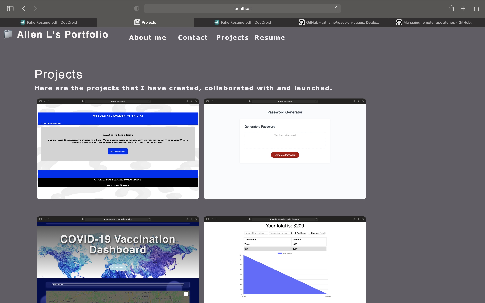

<h1 align="center">React JS Portfolio App</h1>
  
 

## Description
Using React to create an interactive portfolio page of my previous and upcomping projects with a contact page and access to my resume.

## Table of Contents
- [Description](#description)
- [Installation](#installation)
- [Usage](#usage)
- [Screenshot](#screenshot)
- [Deployed](#deployed)
- [License](#license)
- [Contributing](#contributing)
- [Testing](#testing)
- [Questions](#questions)
- [Contact](#contact)

## Installation
> execute in terminal: npm install 
> execute in terminal: npm start 
> Or, visit our deployed GH Pages link. 

## Usage
Visit the link and be presented with a nav bar with my site links 'About Me', "Contact", "Portfolio" and "Resume".
## Screenshot

## Deployed
https://alovatt83.github.io/react-portfolio/

## License

 
This application is covered by the MIT license. 

## Contributing
Visit our repository and request access to contribute.

## Testing
Tested on macOS Big Sur

## Questions
Report any discovered issues here: issues@adlsoftware.com 
 

## Contact
Find me on GitHub: [Alovatt83](https://github.com/Alovatt83) 
 
Call me @: (905) 555-7295
 
Email me with any questions: allenlovatt@gmail.com  

This ReadMe Generator Was Made by [ADL Software Solutions](https://github.com/alovatt83/ReadMe-Generator)
